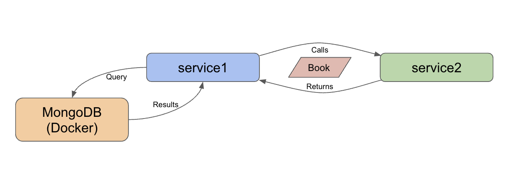

= Microservices Project: Level 3

This project is part of a series for creating microservices. In this repository, we use the following technologies:

* Spring Boot
* Java
* REST services
* Lombok
* MongoDB document database
** running in Docker container
** loaded with Book domain data

We have added domain data on books because most applications interact with some form of data storage. Spring Data MongoDB is an excellent option.

For the domain, we loaded a https://www.kaggle.com/jealousleopard/goodreadsbooks[Goodreads dataset^] publicly available on Kaggle.

== Architecture

We have 2 services in this repository: `service1` and `service2`. Our architecture is the same as the previous https://github.com/JMHReif/microservices-level2[Level2^]; however, our service1 is now interacting with a database in a Docker container. This project passes `Book` objects from the database. Responsibilities of each service are outlined below.

* Service1: backend service for interacting with stored book data and hosting the REST api endpoint (localhost:8081/db/books)
* Service2: client REST service for calling the available REST endpoint in service1 and returning any results (books)

With both services running, we can use service2 to execute whatever service(s) created on the backend (service1).

== Microservices functions

There are a variety of reasons businesses and users might choose to develop applications in a microservices architecture. Some potential reasons are listed below.

* Scalability
* Functionality independence (separating grouped features, often for reliability)
* Maintenance simplicity (changes only affect pieces, and less likely to impact whole)
* Shift resource load (from large instance running single monolith application, to many smaller instances hosting/coordinating microservices)

== Executing the services

To reproduce this intro example, please follow the steps.

1. Clone this repository
2. Run each service (either from an IDE or command line)
3. Test backing service (books): Open a command line window and execute `curl localhost:8081/db/books`.
4. Test client service: Open a command line window and execute `curl localhost:8080/goodreads`.
5. See the results of books appear :)

== Content

* Blog post: https://jmhreif.com/blog/microservices-level3/[Microservices Level 3^]

== Previous steps

* https://github.com/JMHReif/microservices-level1[Level1] - Sending a string message from one Spring Boot app to another
* https://github.com/JMHReif/microservices-level2[Level2] - Retrieving prepopulated Book data from one Spring Boot app to another